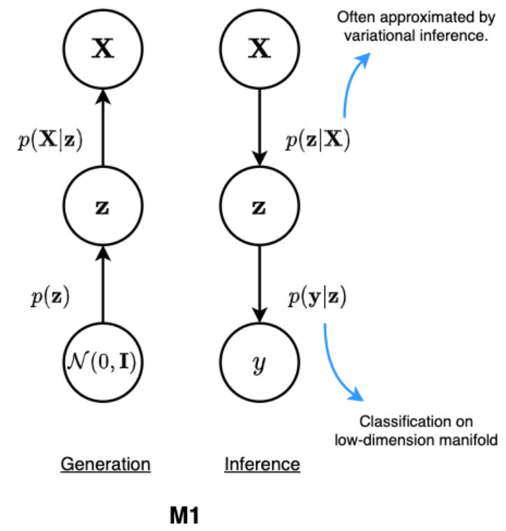
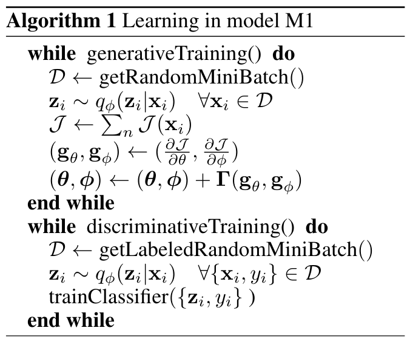
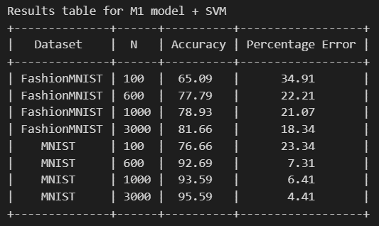
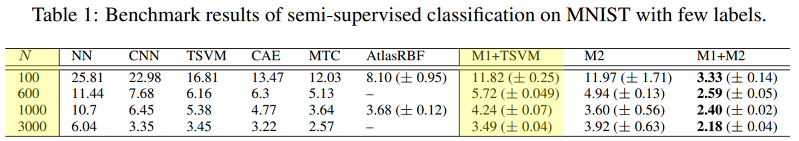

  <h1 align="center">Semi-Supervised learning via a Variational Autoencoder</h1>

## Introduction

In this notebook I implemented the M1 model with SVM (regular SVM) suggested in the paper "Semi-supervised Learning with Deep Generative Models", by Kingsma et al. the M1 scheme, as described in Algorithm1, and detailed throughout the paper. It is based on a VAE for feature extraction, and then a (transductive) SVM for classification. I used regular SVM for simplicity with RBF kernel.

<a href="https://arxiv.org/abs/1406.5298/"><strong>Paper Link</strong></a>

## Dataset

I applied the model on MNIST and Fashion MNIST datasets, and used number of labeled samples as they did in the paper: 100, ,600, 1000 and 3000.

## Model

The M1 model that described in the paper:

  
  

## Hyperparameters

I chose the hyperparameters closet as I can to the suggested parameters in the paper:

| Hyperparameter | Value                |
|----------------|----------------------|
| input_dim      | 784                  |
| hidden_dim     | 600                  |
| latent_dim     | 50                   |
| batch_size     | 64                   |
| learning_rat   | 3e-4                 |
| momentum       | 0.1                  |
| num_epochs     | 100                  |
| N_labeled      | 100, 600, 1000, 3000 |
| kernel         | ‘rbf’                |

## Results

For the results I gathered the accuracy and percentage error for each number of labels and datasets:

  

For comparison, here are the results from the paper:

  

## Conclusions

I will state some conclusions from the results and in addition to the comparison with the results of the article paper.

* As I supplied more labeled samples, the accuracy of the model has improved, for both datasets. This makes sense because I teach the model more information about the data, and it makes it more accurate when testing it. The same thing happened in the results of the paper.
* The accuracy on the MNIST dataset is much better than the Fashion MNIST dataset. The Fashion MNIST has more complicated images compared to the MNIST dataset and has more details. The work of the paper based on the MNIST dataset, so the model they developed optimized on this dataset. For this reason, it is logical that the model will achieve better results on the original dataset.
* Compared to the results of the paper, they reached better results than I did (on the MNIST dataset). This probably happened because a few main reasons:
** They used Transductive SVM and implemented regular one with RBF kernel.
** They trained the model with ~9999999 epochs (shown in the code) and I ran only 100.
** There may be additional differences in the implementations.
* In conclusion, I got a very high accuracy for MNIST dataset of 95.59% and a decent accuracy of 81.66% for the Fashion MNIST dataset. It means the method suggested in the paper is very effective.
